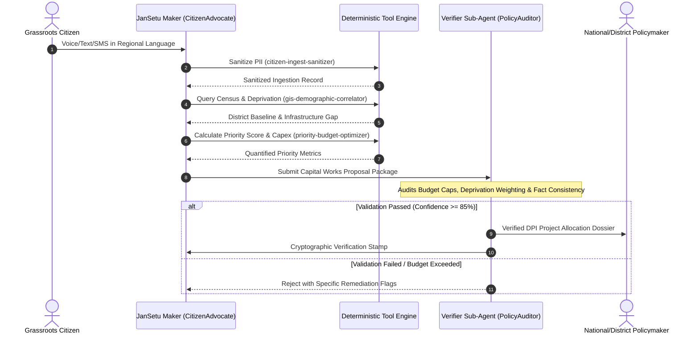

# DUTIES.md — Segregation of Duties (SOD) Policy

## 🏛️ Dual-Control Governance Architecture

JanSetu AI implements an institutional Maker-Checker architecture modeled after national public finance controls. This prevents autonomous AI hallucination from misdirecting public capital expenditure.

---

### 1. Maker Role: `CitizenAdvocate`
- **Primary Duties:**
  - Ingest raw citizen demand streams across vernacular languages.
  - Extract semantic category (Water & Sanitation, Primary Health, Rural Connectivity, Grid Power, Education).
  - Aggregate geographic clusters and synthesize community pain-point narratives.
  - Propose project scope, estimated engineering timeline, and preliminary budget.
- **Boundaries:**
  - Cannot approve final funding requests.
  - Cannot alter ground-truth census indices or budget allocation ceilings.

---

### 2. Checker Role: `PolicyAuditor` (Sub-Agent: `agents/verifier`)
- **Primary Duties:**
  - Independently verify that Maker's calculations adhere to the Priority Urgency Score formula.
  - Validate that proposed capital costs align with standard public works schedules of rates (SoR).
  - Verify that the target location's Multi-dimensional Poverty Index (MPI) justifies emergency fast-tracking.
  - Check that zero unmasked PII appears in the policymaker dispatch.
- **Boundaries:**
  - Cannot alter citizen demand text or suppress legitimate grassroots grievances.
  - Cannot invent alternative project proposals without returning to Maker for synthesis.
