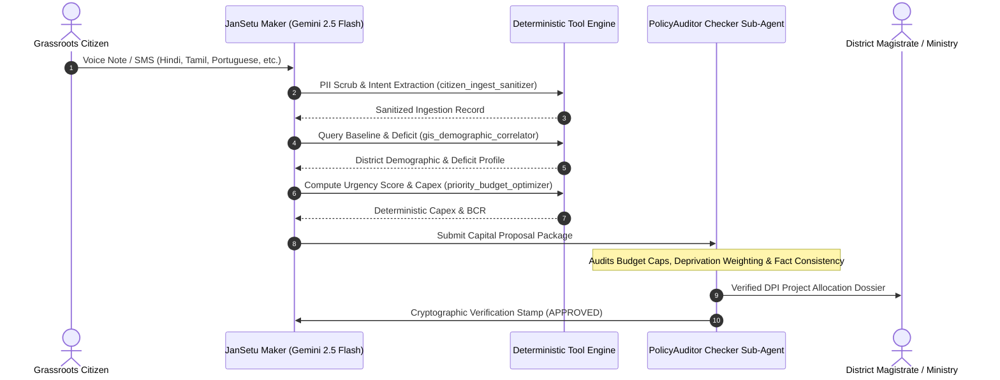

# JanSetu AI (जनसेतु) — Citizen-to-Governance DPI Bridge
### *An OpenGAP Git-Native Multilingual Digital Public Good powered by Google Gemini*

[](https://hack2skill.com/event/codeforcommunities2)
[](#)
[](#)
[](https://github.com/open-gitagent/opengap)
[](#)
[](LICENSE)

---

## 🏛️ Executive Summary

Governments across developing and BRICS nations invest billions into public works programs. Yet, public spending often fails to reach the communities that need it most. Citizen feedback lives fragmented across grievance portals, local voice calls, and WhatsApp messages in dozens of regional languages, while centralized capital allocation relies on static annual budgets rather than real-time demand.

**JanSetu AI (जनसेतु / The People's Bridge)** is an open-source, Git-native **Digital Public Good (DPG)** compliant with the **OpenGAP (Open Git Agent Protocol)** standard. It establishes a closed-loop intelligence bridge:

1. **Grassroots Multilingual Ingestion:** Ingests citizen development requests via voice notes, text, and SMS across Hindi, Tamil, Telugu, Bengali, Marathi, Portuguese, and English.
2. **Zero-Trust Edge Sanitization:** Instantly redacts Aadhaar numbers, phone numbers, and PII before reasoning.
3. **Census & Deprivation Grounding:** Cross-references citizen distress with national Multi-dimensional Poverty Indices (MPI) and baseline infrastructure deficit statistics.
4. **Institutional Maker-Checker Governance:** Primary Maker agent (`CitizenAdvocate`) synthesizes capital project proposals; an independent Checker sub-agent (`PolicyAuditor`) audits budget caps, verifies calculations, and stamps cryptographic verification seals.
5. **Actionable Policymaker Dispatch:** Generates verified capital works dossiers with quantified Priority Urgency Scores (PUS) and Benefit-to-Cost Ratios (BCR) for state and district magistrates.

---

## 🎯 Competition & Track Alignment

* **Hackathon:** Build with AI: Code for Communities (Second Edition)
* **Organizers:** Google Cloud, MeitY (Ministry of Electronics and Information Technology), Startup India, Hack2skill
* **Track:** **Track 1 — AI for Digital Public Infrastructure & Governance**
* **BRICS Pillar:** **Innovation**
* **Target Audience:** Grassroots citizens, village panchayats, district collectors, and national infrastructure planners.

---

## 📁 OpenGAP Canonical Repository Structure

JanSetu AI strictly adheres to the **OpenGAP** git-native specification:

```text
codeforcommunities/
│
│   # ── Core Identity ─────────────────────────────────────
├── agent.yaml              # Manifest (Gemini 2.5 Flash → 2.0 Flash → 1.5 Pro)
├── SOUL.md                 # Identity, ethos, communication style, civic values
│
│   # ── Behavior & Rules ──────────────────────────────────
├── RULES.md                # Hard Invariants (Zero PII, Zero Hallucination, Mandated Checks)
├── DUTIES.md               # Segregation of Duties (Dual-Control Maker-Checker)
├── AGENTS.md               # Framework-agnostic execution guide
│
│   # ── Capabilities ──────────────────────────────────────
├── skills/                 # Modular capability definitions
│   └── community-analyzer/
│       └── SKILL.md        # Procedural execution steps for demand scoring
├── tools/                  # Declarative tool schemas & Python implementations
│   ├── citizen_ingest_sanitizer.py    # PII scrubbing & language detection
│   ├── gis_demographic_correlator.py  # Census baseline & MPI mapping
│   ├── priority_budget_optimizer.py   # Deterministic Capex & PUS math
│   └── tool_definition.yaml           # MCP-compatible JSON Schemas
├── workflows/              # Multi-step playbooks
│   └── multi_step_workflow.md
│
│   # ── Knowledge & Memory ────────────────────────────────
├── knowledge/              # Authoritative ground-truth datasets
│   ├── brics_districts_baseline.json  # Aspirational districts demographics & MPI
│   ├── infrastructure_sor_rates.json  # Public Works Schedule of Rates (SoR)
│   └── overview.md
├── memory/runtime/         # Persistent cross-session state & audit
│   ├── context.md          # Active environment session context
│   └── dailylog.md         # Cryptographic execution audit log
│
│   # ── Lifecycle & Ops ───────────────────────────────────
├── hooks/                  # Lifecycle triggers
│   ├── bootstrap.md        # System instruction & model startup
│   └── teardown.md         # Audit flush & state commit
├── config/                 # Environment configurations
│   └── default.yaml        # Google Cloud project & model parameters
├── compliance/             # Regulatory compliance artifacts
│   └── governance.md       # DPG, MeitY & Google Responsible AI alignment
│
│   # ── Composition ───────────────────────────────────────
├── agents/                 # Recursive sub-agents
│   └── verifier/           # Independent PolicyAuditor (Checker role)
│       ├── agent.yaml
│       ├── SOUL.md
│       ├── DUTIES.md
│       └── audit_checker.py # Mathematical & PII audit validation
├── examples/               # Calibration interactions (few-shot)
│   └── calibration_dialogue.md
│
│   # ── Full-Stack Demonstration ──────────────────────────
├── engine.py               # Master OpenGAP runtime loop with Google Gemini
├── app.py                  # Zero-dependency Python server (API + Web UI)
├── web/
│   ├── index.html          # Interactive Command Dashboard (Citizen & Policymaker)
│   └── slides.html         # Interactive 8-Slide Pitch Deck (PDF exportable)
└── .gitagent/              # Isolated runtime state (gitignored)
```

---

## ⚡ Technical Innovation & Google AI Stack

### 1. Dual-Control Maker-Checker Model (`DUTIES.md`)
Unlike standard generative chatbots that risk hallucinating multi-million rupee budgets, JanSetu AI separates creation from authorization:
* **Maker (`CitizenAdvocate`):** Powered by Gemini 2.5 Flash (fallbacks: 2.0 Flash, 1.5 Pro), translates citizen distress into a structured capital works project.
* **Checker (`PolicyAuditor`):** A dedicated sub-agent that verifies the selected demo rate-card item, recomputes the Priority Urgency Score, checks for common PII leaks, and issues a provisional cryptographic seal (`SEAL-XXXXXXXX`). A human officer remains the allocation authority.



### 2. Deterministic Priority Urgency Formula
$$PUS = \left( 0.35 \times \text{Normalized Demand Volume} + 0.35 \times \text{MPI Deprivation Index} + 0.30 \times \text{Infrastructure Deficit Score} \right) \times 100$$

* Ensures remote, impoverished hamlets (high MPI) receive immediate priority even if their raw complaint count is smaller than dense urban wards.

### 3. Track 1 Integration Surfaces
* **Messaging adapter:** `POST /api/webhook/whatsapp` accepts a WhatsApp Cloud-style payload; `POST /api/webhook/twilio` accepts Twilio SMS-style form or JSON payloads. Configure `JANSETU_WEBHOOK_SECRET` to require an `X-JanSetu-Signature: sha256=...` HMAC header. Local demo mode hashes sender tokens and never forwards them to the model.
* **Demand hotspots:** `GET /api/hotspots` aggregates sanitized `.gitagent/demand_events.jsonl` records by district and category, exposing request count, Checker-approved count, average PUS, channels, coordinates, and deterministic capex.
* **Scheme mapping:** Every costed recommendation includes a curated `scheme_mapping` from `knowledge/public_investment_schemes.json`. It is a review routing aid with source references, never an automatic approval.

### 4. Google Gemini 2.5 Flash (fallbacks: 2.0 Flash, 1.5 Pro) Integration
* **Multilingual Nuance:** Native comprehension of low-resource Indian languages (Hindi, Tamil, Telugu, Bengali, Marathi) and BRICS partner tongues (Portuguese, Russian).
* **Multimodal Readiness:** Ready to ingest citizen photos of damaged infrastructure (bridges, roads, water treatment plants) via Gemini Vision.
* **Structured Output Schema:** Enforces strict adherence to JSON schema, feeding directly into administrative dashboards.

---

## 🚀 Quick Start Guide (Zero External Dependencies)

JanSetu AI runs out of the box using Python's standard library.

### 1. Clone & Enter Directory
```bash
cd D:\hackathon\codeforcommunities
```

### 2. (Optional) Set your Google Gemini API Key
```bash
# Optional: If unset, JanSetu automatically runs its built-in deterministic OpenGAP engine!
set GEMINI_API_KEY=your_gemini_api_key_here
```

### 3. Run the Command Dashboard Server
```bash
python app.py 8080
```

### 4. Open in Browser
* **Interactive Command Dashboard:** [http://localhost:8080](http://localhost:8080)
* **8-Slide Pitch Deck (Presentation):** [http://localhost:8080/slides.html](http://localhost:8080/slides.html)

---

## 📊 Live Verification Test Cases

| Case | Location & Domain | Citizen Input | Census Grounding | Capex Recommendation | Checker Status |
|---|---|---|---|---|:---:|
| **#1** | **Katihar, Bihar**<br>*(Water & Sanitation)* | *"5 days pipeline leak, dirty water in Barari village"* (Hindi) | MPI: 0.428<br>Water Deficit: 47.6% | **Solar Borewell + RO/UV Plant**<br>₹8.5 Lakhs ($10,180 USD) for 2,500 people | `APPROVED`<br>`SEAL-33BAFD9478427850` |
| **#2** | **Bahraich, UP**<br>*(Primary Health)* | *"No doctor at Nanpara PHC for 2 weeks"* (Hindi) | MPI: 0.492<br>Doctor Deficit: 54.2% | **Telemedicine Kiosk & Solarization**<br>₹12.5 Lakhs ($14,970 USD) for 8,000 people | `APPROVED`<br>`SEAL-8B29C1F03E4A11D8` |
| **#3** | **Juazeiro, Brazil**<br>*(Water & Sanitation)* | *"10 days without drinking water in rural settlement"* (Portuguese) | MPI: 0.210<br>Water Deficit: 26.0% | **Artesian Well Network Maintenance**<br>₹8.5 Lakhs ($10,180 USD) for 2,500 people | `APPROVED`<br>`SEAL-E9102B47C539A801` |

---

## 🏆 MeitY Digital Public Good (DPG) Alignment

1. **Open Source & Extensible:** Apache 2.0 license with standardized OpenGAP schemas.
2. **Citizen Privacy by Design:** Regex-based redaction of Aadhaar, phone and email before any model call.
3. **Non-Discriminatory & Accessible:** Supports voice and text in native regional scripts with browser speech synthesis.
4. **Institutional Scalability:** Plugs directly into existing e-Governance channels (WhatsApp Citizen Helplines, UMANG, PM GatiShakti National Master Plan).

---

## 📜 License & Acknowledgments

* Licensed under the **Apache License, Version 2.0**.
* Developed for **Code for Communities 2.0** powered by Google Cloud & supported by Google Developer Groups (GDG) India.
* Built on the **OpenGAP (Open Git Agent Protocol)** specification pioneered by the open-source GitAgent community.
